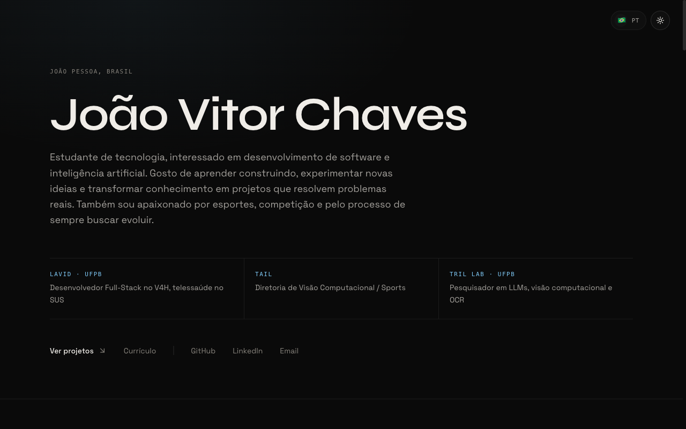
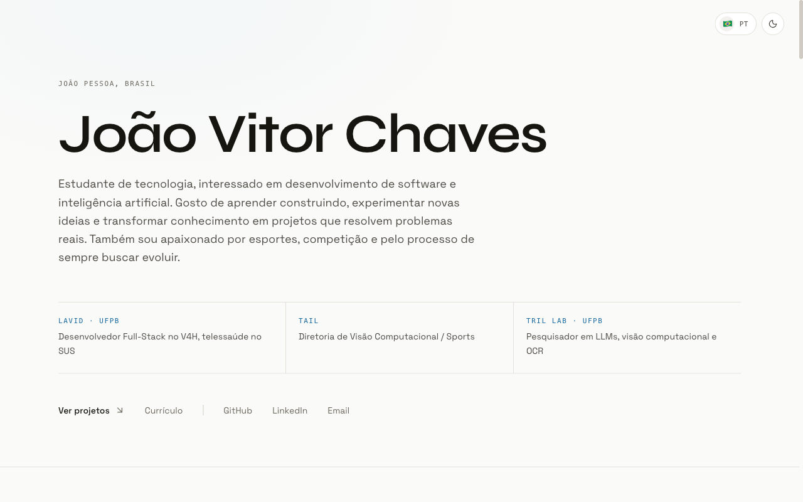

<div align="center">

# João Vitor Chaves

**Portfólio pessoal.** Desenvolvedor full-stack e pesquisador em IA aplicada.

[**mylandpage.vercel.app**](https://mylandpage.vercel.app) · [English version](https://mylandpage.vercel.app/en) · [Currículo](https://mylandpage.vercel.app/cv)




</div>

---

## Sobre

Site que reúne minha trajetória e os sistemas que construí, de agentes com LLMs
e visão computacional a engenharia de dados e software de saúde em produção.

O projeto é estático de ponta a ponta: as 27 páginas são geradas no build,
incluindo cada projeto nos dois idiomas.

## O que tem aqui

| | |
|---|---|
| **Bilíngue** | Todo o conteúdo em português e inglês, com seletor que preserva a página atual |
| **Tema claro e escuro** | Transição em círculo pela View Transitions API, com a escolha lembrada e a preferência do sistema respeitada |
| **Páginas de projeto** | Oito sistemas descritos com arquitetura, funcionamento e stack, navegáveis entre si |
| **Currículo** | Página própria exportável em PDF, gerada dos mesmos dados do site |
| **404 própria** | Com a metáfora que me cabe: quando a posição não está lá, volta para a guarda |
| **SEO** | Sitemap com alternates por idioma, robots, dados estruturados de pessoa e imagem de compartilhamento gerada no build |
| **Acessibilidade** | Skip link, foco preso no menu mobile, marcação da seção ativa e `prefers-reduced-motion` respeitado |

<div align="center">

</div>

## Decisões que valem nota

**Nenhuma biblioteca de animação.** A entrada da dobra e as transições são CSS.
Trocar framer-motion por isso derrubou o bundle de 135 kB para 97 kB.

**Nada de conteúdo escondido esperando JavaScript.** Cheguei a implementar
revelação por scroll, mas ela deixava a página inteira com `opacity: 0` até o
observador disparar. Um leitor de tela, um crawler ou uma falha de script viam
uma página em branco. O conteúdo agora nasce visível no HTML.

**Tema aplicado antes da primeira pintura.** Um script inline lê a preferência
salva e define a classe no `<html>`, então não existe flash branco ao carregar
no escuro.

**Tokens de cor em duas paletas.** O acento muda de `#7EC8F5` para `#17689E` no
tema claro: o azul original tem contraste insuficiente sobre fundo branco.

**Links honestos.** O botão de repositório só aparece quando o código é
público. Nos projetos privados, a página diz isso, em vez de mandar a pessoa
para um 404 do GitHub.

## Stack

**Next.js 14** com App Router e geração estática · **TypeScript** ·
**Tailwind CSS** com tokens em CSS custom properties · **Syne** e
**Space Grotesk** via `next/font` · **next-view-transitions** para as
transições entre páginas · deploy na **Vercel**.

## Rodando localmente

```bash
npm install
npm run dev
```

O site sobe em `http://localhost:3000`. A versão em inglês fica em `/en`.

```bash
npm run build   # gera as 27 páginas estáticas
npm run lint
```

## Estrutura

```
src/
├── app/
│   ├── page.tsx            # home em português
│   ├── cv/                 # currículo
│   ├── projects/[slug]/    # página de cada projeto
│   ├── en/                 # as mesmas rotas em inglês
│   ├── sitemap.ts          # rotas nos dois idiomas, com alternates
│   └── opengraph-image.tsx # imagem de compartilhamento gerada no build
├── components/
│   ├── pages/              # composição de cada página, recebendo o idioma
│   └── ui/                 # primitivos de seção
└── lib/
    ├── i18n.ts             # dicionário da interface e da bio
    ├── projects.ts         # os projetos, em português
    ├── projects-en.ts      # tradução aplicada por cima, campo a campo
    └── experience.ts       # trajetória nos dois idiomas
```

Uma foto salva como `public/retrato.jpg` aparece automaticamente no bloco
"Quem sou": a detecção acontece no build.

## Contato

[joaovitorchavesdesouza@gmail.com](mailto:joaovitorchavesdesouza@gmail.com) ·
[LinkedIn](https://linkedin.com/in/jvchaaves) ·
[GitHub](https://github.com/jvchaaves)
